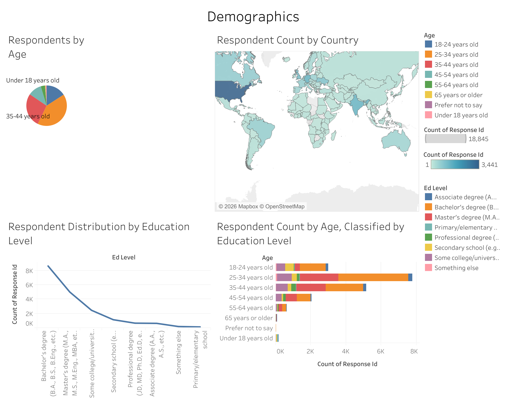

# Data Analyst Capstone Project
## Analysis of Current and Future Trends in Technical Skills

---

**Completed:** May 2025 | **IBM Data Analyst Professional Certificate**

---

## 📊 Project Overview

This capstone project analyzes technology adoption trends across demographics to identify skills gaps and future workforce needs. The analysis covers the complete data science lifecycle: data collection from multiple sources, comprehensive data cleaning and normalization, exploratory statistical analysis, and interactive dashboard visualization.

**Key Question:** How do technology skills and adoption patterns differ across age groups and education levels, and what skills will be most critical in the future?

### Primary Deliverable
**Interactive Tableau Dashboard:** [View on Tableau Public](https://public.tableau.com/app/profile/richardlam4391/viz/IBMDataAnalystCapstoneProject_17807052494200/Dashboard3)

---

## 🎯 Key Findings

* Current technology adoption shows strong correlation with age demographics
* Future skills demand indicates growth in AI/ML and cloud technologies
* Education level significantly influences technology tool proficiency
* Clear segmentation exists between present skills and anticipated future needs

1) Current Technology Usage

2) Future Technology Usage 

3) Demographics

---

## 🛠 Technical Stack

| Category | Tools |
| :--- | :--- |
| **Languages** | Python, SQL |
| **Data Collection** | BeautifulSoup, Requests (HTTP/APIs) |
| **Data Processing** | Pandas, NumPy |
| **Visualization** | Tableau, Plotly, Seaborn, Matplotlib |
| **Databases** | SQLite, IBM Db2 |
| **Environment** | Jupyter Notebooks, IBM Cloud |

---

## 📁 Project Structure

### Data Pipeline (Labs 1-11)
* **Lab 1:** HTTP Requests and API data collection
* **Lab 2-4:** Web scraping job posting data
* **Lab 5:** Initial dataset exploration
* **Lab 6-7:** Duplicate detection and removal
* **Lab 8-9:** Missing value identification and imputation
* **Lab 10-11:** Data normalization and wrangling

### Analysis & Visualization (Labs 12-24)
* **Lab 12:** Exploratory Data Analysis (EDA)
* **Lab 13-15:** Statistical analysis (distributions, outliers, correlations)
* **Lab 16-24:** Visualization techniques (histograms, scatter plots, bubble plots, bar charts, line charts, etc.)

### Deliverables
* `2025 IBM Capstone Project Data Analyst Presentation.pptx` — Executive summary
* `2025 IBM Capstone Project Data Analyst Presentation.pdf` — Presentation PDF
* `IBM Data Analyst Capstone Project Tableau.pdf` — Dashboard documentation
* Dashboard exports (PNG files) - Visualizations and dashboard screenshots

---

## 📊 Data Sources

* This project covers [Stack Overflow Annual Developer Survey](https://survey.stackoverflow.co/):
  * Job posting APIs (employment data)
  * Web scraping (technology trends, surveys)
  * Aggregated survey responses (demographics)

**Total Records Processed:** ~10,000+ entries after cleaning  
**Data Quality:** Handled missing values, duplicates, and outliers; normalized across multiple sources

---

## 💡 Key Skills Demonstrated

✅ **Data Collection** — API integration, web scraping with BeautifulSoup  
✅ **Data Cleaning** — Duplicate removal, missing value imputation, normalization  
✅ **Statistical Analysis** — Distribution analysis, correlation studies, outlier detection  
✅ **Data Visualization** — Multi-tool approach (Tableau, Python libraries)  
✅ **SQL & Databases** — Data extraction and transformation  
✅ **Business Communication** — Executive presentation and dashboard design  

---

## 📈 Visualization Highlights

The Tableau dashboard includes:
* **Current Technology Usage** — Real-time technology adoption by demographic segment
* **Future Technology Trends** — Projected skill demand and emerging tools
* **Demographics Analysis** — Distribution across age groups and education levels
* **Correlation Matrices** — Relationships between variables

---

## 🔗 Links

* **Dashboard:** [Tableau Public](https://public.tableau.com/app/profile/richardlam4391/viz/IBMDataAnalystCapstoneProject_17807052494200/Dashboard3)
* **Repository:** [GitHub](https://github.com/richardlam4391/IBM-Data-Analyst-Professional-Certificate/tree/main/Introduction%20to%20Data%20Analytics)
* **Certification:** [Data Analyst Capstone Project (Coursera)](https://www.coursera.org/account/accomplishments/verify/BA5ORVTRAE0U)
